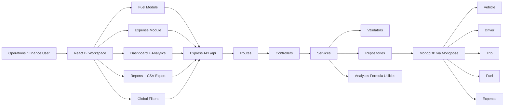

# TransitOps Architecture Diagram

## Clean Architecture Layers

- `models/`: MongoDB schemas and indexes.
- `validators/`: request normalization, enum validation, positive number checks, ObjectId checks, and date validation.
- `repositories/`: pagination, sorting, searching, filtering, population, and aggregation queries.
- `services/`: business rules, reference guards, BI formulas, and reusable serialization.
- `controllers/`: HTTP response orchestration with the shared success/error contract.
- `routes/`: API surface under `/api`.
- `frontend/src/features/bi/`: dashboard, fuel, expense, analytics, reports, filters, reusable states, charts, and API services.

## Data Ownership

- Fuel records belong to vehicles and may belong to trips.
- Expenses belong to vehicles and may belong to trips.
- Trip revenue and distance feed fuel efficiency and ROI.
- Vehicle acquisition cost feeds ROI.
- Vehicle status feeds fleet utilization and dashboard status charts.
