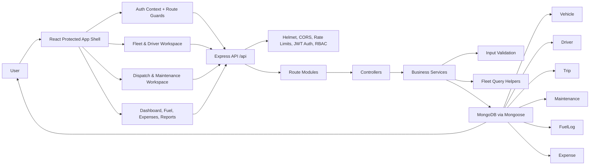

# TransitOps Architecture Diagram

## Working Modules

- Auth and RBAC: login, current user, logout, protected routing, role-aware navigation.
- Fleet: vehicle CRUD, driver CRUD, compliance dashboard, available vehicle and driver APIs.
- Operations: trip CRUD, dispatch, completion, cancellation, maintenance open/close, automatic status changes.
- Finance: dashboard metrics, fuel logs, expenses, reports, and CSV export.

## Safe Integration Note

The working app lives under `transitops/`. Some remote prototype branches contain a second root-level scaffold and are not merged directly because they would delete working modules from this app.
