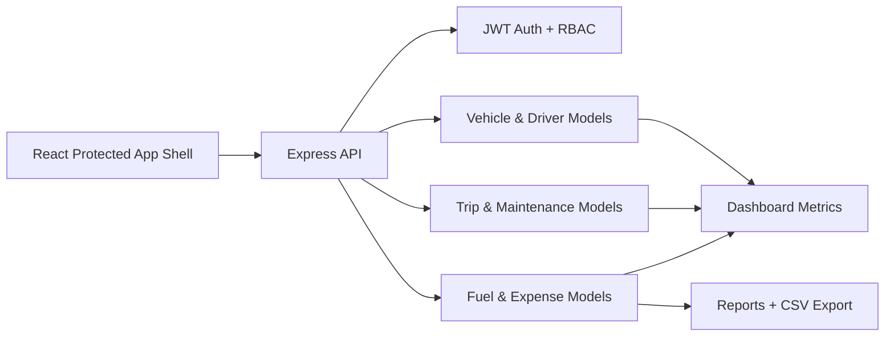

# TransitOps Person 4 Presentation Pack

## Architecture Diagram

## Demo Script

1. Sign in as `admin@transitops.demo`.
2. Open Fleet and confirm vehicles/drivers are managed with status badges.
3. Open Dispatch and create a trip using available vehicle and driver IDs.
4. Dispatch the trip and show automatic asset status changes.
5. Add a fuel log and an expense from the Finance pages.
6. Open Dashboard/Analytics and explain utilization, cost, fuel efficiency, and ROI.
7. Open Reports and export Vehicle, Trip, Cost, Fuel, and ROI CSV files.

## Screenshot Checklist

- Login page
- Fleet registry
- Driver registry
- Dispatch workspace
- Maintenance workspace
- Finance dashboard
- Reports CSV export controls

## Submission Checklist

- Backend tests pass
- Frontend tests pass
- Production build passes
- `npm audit --omit=dev` reports zero vulnerabilities
- `.env` is not committed
- Demo users, demo vehicles, and demo drivers seeded locally
